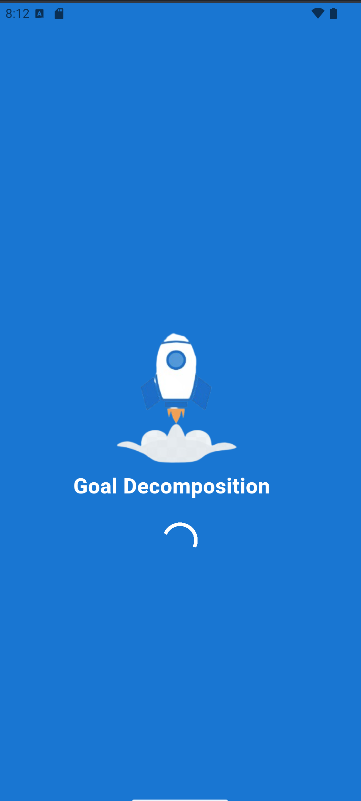
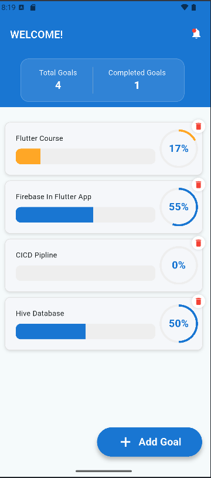
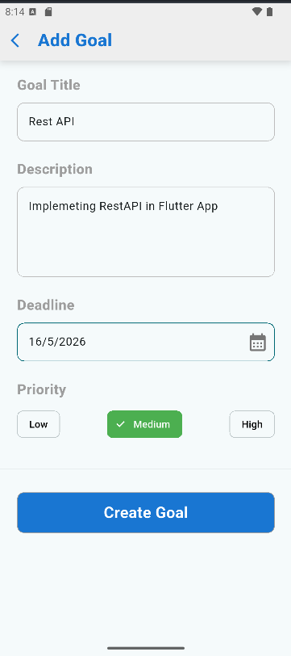
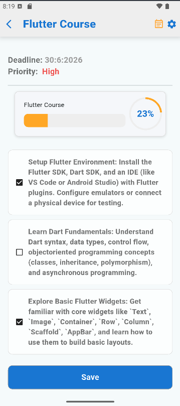
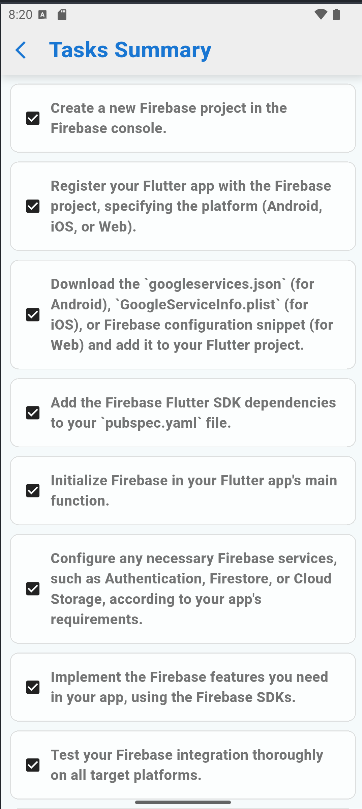
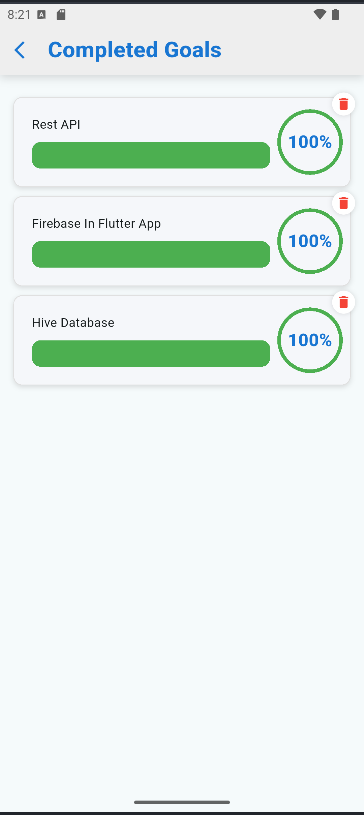
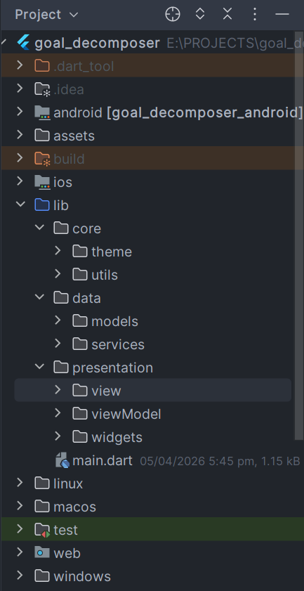

# Goal Decomposer App

Goal Decomposer is a Flutter application that helps users break down their goals into manageable tasks 
and track their progress. It leverages **Hive** for local data storage, **Provider** for state management, 
and integrates **OpenRouter AI** for intelligent goal suggestions and task automation.

---

## Features

- Create, edit, and delete goals and tasks.
- Track progress with dynamic progress indicators.
- Intelligent AI-powered task suggestions via OpenRouter AI.
- Local persistence using Hive for offline support.
- Clean and responsive UI with Flutter.

---
## Statemanagment
- Provider

---

## Screenshots

### App Icon


### Splash Screen


### Home Screen


### Add Goal


### Goal Details


### AI Suggestions


### Total Goal Completed Screen


### Goal Completed Screen


### Folder Structure


---

## Demo Video

Watch the demo video of Goal Decomposer in action:

[Demo Video](https://youtube.com/shorts/aMnZPYv3vB0?si=pBRZtygTLsF4qE3-)

---

## Getting Started

### Prerequisites

- Flutter SDK ≥ 3.0
- Dart ≥ 2.18
- A modern IDE (Android Studio)

### Installation
1. Clone the repository:
```bash
git clone https://github.com/bilalah211/goal-decomposer.git
cd goal-decomposer
